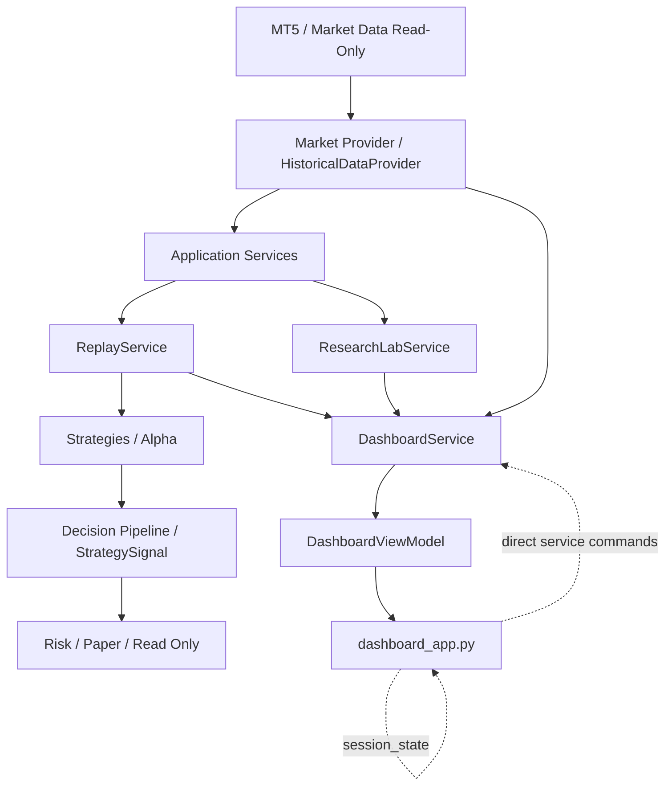

# TRADERIA_FULL_STACK_ARCHITECTURE_AUDIT.md

## Missao Critica - Auditoria Completa Frontend, Backend, UX e Arquitetura

Projeto: TraderIA_WDO  
Data: 2026-06-29  
Tipo: Diagnostico arquitetural, sem implementacao  
Status: Concluido

## Resumo Executivo

O TraderIA_WDO tem uma base tecnica forte: dominio protegido, suite de testes extensa, regras arquiteturais formalizadas, audit oficial passando e operacao real explicitamente proibida. A plataforma nao esta em colapso; ela esta em uma fase comum de sistemas que cresceram por muitas sprints incrementais: a arquitetura institucional amadureceu mais rapido do que a experiencia visual e mais rapido do que a modelagem de contratos entre frontend e backend.

O problema central nao e ausencia de componentes. E excesso de componentes expostos sem um modelo de produto unificado.

A principal falha estrutural e esta:

```text
O backend evoluiu por missoes pequenas.
O frontend acumulou paineis para cada missao.
O DashboardService virou uma fachada grande demais.
O DashboardViewModel ainda e parcialmente um envelope de compatibilidade.
O usuario ve uma mistura de plataforma, laboratorio, diagnostico e historico tecnico.
```

Resultado: o TraderIA funciona, mas ainda parece uma bancada de desenvolvimento, nao uma plataforma profissional de pesquisa quantitativa.

## Validacoes Executadas

| Validacao | Resultado |
| --- | --- |
| `python scripts\architecture_audit.py` | OK |
| `python -m unittest discover -s tests` | 3188 tests OK |

## Evidencias Quantitativas

| Metrica | Resultado |
| --- | --- |
| Arquivos Python analisados nas camadas principais | 329 |
| Linhas Python nas camadas principais | 29876 |
| Arquivos de teste | 372 |
| Linhas de teste | 72482 |
| Chamadas Streamlit em `dashboard_app.py` | 403 |
| Chamadas diretas a `DashboardService` em `dashboard_app.py` | 63 |
| Funcoes top-level em `dashboard_app.py` | 188 |
| Funcoes alcancaveis a partir de `main()` | 154 |
| Funcoes top-level nao alcancaveis em `dashboard_app.py` | 34 |
| Linhas em `dashboard_app.py` | 3292 |
| Linhas em `application/dashboard_service.py` | 2503 |
| Linhas em `application/research_lab_service.py` | 1191 |
| Linhas em `application/replay_service.py` | 801 |

## Pontos Fortes

- O `domain/` permanece pequeno e relativamente puro.
- O audit oficial de arquitetura passa.
- A suite automatizada e ampla.
- O Dashboard importa somente `DashboardService`, preservando uma fronteira formal.
- A operacao real continua proibida.
- Ha contratos explicitos para muitos objetos de pesquisa, validacao, portfolio, mercado e dataset.
- O projeto possui governanca escrita: `MANIFEST.md`, `ARCHITECTURE_RULES.md` e `TRADERIA_ARCHITECTURE_BIBLE.md`.
- A cultura de testes ja existe e protege regressao de API publica.
- O dataset PETR4 esta integrado visualmente como pesquisa, separado do ativo operacional WDO.

## Diagnostico Principal

O TraderIA nao sofre hoje por falta de backend. Sofre por falta de um modelo de apresentacao institucional unico.

O fluxo ideal seria:

```text
Backend produz estado institucional unico
        |
DashboardService compoe um ViewModel completo
        |
Dashboard apenas renderiza secoes a partir do ViewModel
        |
Usuario entende estado, dataset, replay, alpha e research sem navegar por detalhes internos
```

O fluxo real ainda e:

```text
Dashboard chama DashboardService muitas vezes
        |
DashboardService agrega dezenas de subsistemas
        |
Dashboard ainda acessa compatibility_data e atributos legados
        |
Paineis antigos, demo, paper, live e research convivem na mesma superficie
        |
O usuario precisa interpretar o sistema
```

## Fase 1 - Auditoria da Arquitetura

### Achados

1. `application/` concentra dependencia para quase todas as camadas.
   - Importa `analytics`, `core`, `domain`, `infrastructure`, `market`, `market_data`, `paper`, `replay`, `research`, `risk` e `strategies`.
   - Isso e aceitavel se a camada for orquestradora, mas no estado atual ela esta acumulando tambem DTOs, ViewModels, compatibilidade, demo, dataset, replay e research.

2. `research/` importa `application`.
   - Este e um sinal de inversao perigosa.
   - Pesquisa deveria depender de contratos, nao da camada de aplicacao.

3. `core/` importa `strategies`.
   - Foram detectados `core/engine.py` e `core/order_manager.py` importando `strategies.base`.
   - Isso enfraquece a ideia de core independente.

4. Existem classes duplicadas com nomes iguais em lugares diferentes:
   - `HistoricalDatasetCatalog` em `market_data`, `market_data/catalog` e `historical/contracts`.
   - `HistoricalDatasetMetadata` em `market_data` e `historical/contracts`.
   - `Alpha001WinRateEngine` e `Alpha001WinRateResult` em dois arquivos: `alpha001_winrate_engine.py` e `alpha001_win_rate_engine.py`.
   - `DuckDBHistoricalDataAdapter` e `ParquetHistoricalDataAdapter` em raiz de `market_data` e tambem em `market_data/adapters`.

5. Ha muitos contratos historicos criados por sprint incremental que protegem arquitetura, mas aumentam superficie cognitiva.

6. O audit oficial passa porque verifica regras institucionais principais, nao porque prova coesao, UX ou simplicidade.

### Risco

O sistema pode continuar passando testes e audit mesmo acumulando complexidade de produto, porque a governanca atual mede mais fronteiras proibidas do que qualidade de composicao.

## Fase 2 - Auditoria Frontend

Arquivo auditado: `dashboard_app.py`.

### Achados

1. `dashboard_app.py` tem 3292 linhas e 188 funcoes top-level.
2. Ha 403 chamadas diretas ao Streamlit.
3. Ha 63 chamadas a metodos de `DashboardService`.
4. Existem 34 funcoes top-level nao alcancaveis a partir de `main()`.
5. Existem componentes antigos ainda presentes:
   - `exibir_dashboard_research_alpha001`
   - `exibir_ranking_alpha001_research_lab`
   - `exibir_exportacao_alpha001_research_lab`
   - `exibir_robustez_alpha001_research_lab`
   - `exibir_alpha001_paper_status`
   - `exibir_alpha001_paper_report`
6. O dashboard mistura:
   - Home institucional.
   - Workbench.
   - Replay.
   - Live.
   - Research.
   - Paper.
   - Dataset profile.
   - Historico tecnico.
7. A UI ainda contem muitos `N/D`, o que e seguro, mas enfraquece a experiencia de produto quando aparece demais.
8. Ha fluxo de estado por `st.session_state` para replay pending actions, dataset, mensagens e service singleton.
9. Nao ha separacao de componentes por arquivo. Tudo esta no mesmo modulo.

### UX

O dashboard ainda obriga o usuario a entender a arquitetura interna. Ele mostra muito do "como o sistema e feito" e pouco do "o que devo fazer agora".

## Fase 3 - Auditoria Backend

### DashboardService

`DashboardService` e o maior gargalo arquitetural.

Evidencias:

- 2503 linhas.
- 19 classes/DTOs no mesmo arquivo.
- 173 funcoes/metodos.
- 27 modulos importados.

Responsabilidades acumuladas:

- Compor `DashboardData`.
- Compor `DashboardViewModel`.
- Gerenciar dataset ativo.
- Carregar dataset para Replay.
- Expor Research Lab.
- Expor Alpha001 status, ranking, robustez, exportacao e paper.
- Agregar provider metrics.
- Adaptar live research.
- Fazer fallback de dados demonstrativos.
- Gerenciar compatibilidade legada.

Conclusao: `DashboardService` e uma fachada, mas esta muito proximo de virar Service Locator e Presentation Aggregator ao mesmo tempo.

### ReplayService

`ReplayService` esta funcional, mas tambem cresceu:

- 801 linhas.
- Carrega demo candles.
- Carrega dataset historico.
- Controla estado de replay.
- Produz `ReplayData`.
- Processa strategy, feature, regime, research, paper metrics e eventos.

Risco: Replay esta se tornando "mini-runtime" completo.

### ResearchLabService

`ResearchLabService` tem forte presenca de metodos demo:

- `run_demo_experiment`
- `run_demo_alpha001_experiment`
- `run_demo_benchmarks`
- `run_demo_parameter_grid`

Esses metodos ainda aparecem como contrato publico e em testes, mesmo quando a UI tenta privilegiar dataset real. Isso cria ambiguidade institucional.

### ViewModels e DTOs

O `DashboardViewModel` e uma boa direcao, mas ainda tem:

```python
compatibility_data: Any | None
__getattr__ como fallback temporario
```

Isso resolve sintomas, mas mascara a migracao incompleta. Enquanto o Dashboard depender de `compatibility_data`, o contrato unico ainda nao e realmente unico.

## Fase 4 - Comunicacao Front x Back

### Como o backend conversa com o frontend?

Formalmente:

```text
dashboard_app.py -> DashboardService -> DashboardViewModel / DashboardData
```

Na pratica:

```text
dashboard_app.py -> DashboardService.get_dashboard_view_model()
dashboard_app.py -> compatibility_data via __getattr__
dashboard_app.py -> multiplas chamadas extras ao DashboardService
dashboard_app.py -> st.session_state com estado proprio
```

### Existe contrato?

Sim, mas incompleto.

Existe `DashboardViewModel`, mas ele ainda nao cobre tudo que o frontend renderiza. Por isso ha fallback para `DashboardData`.

### O Dashboard recebe um objeto unico?

Parcialmente. O `main()` recebe um ViewModel, mas varias interacoes chamam o service novamente e atualizam estado localmente.

### Existem chamadas duplicadas?

Sim. `dashboard_app.py` chama `get_dashboard_data` 9 vezes e varios comandos de replay/research diretamente em handlers.

### Existe estado duplicado?

Sim:

- Estado em `ReplayService`.
- Estado em `ResearchLabService`.
- Estado em `DashboardService`.
- Estado em `st.session_state`.
- Estado em `DashboardViewModel.compatibility_data`.

### O DashboardService e uma facade?

Sim no sentido de fronteira unica de import.  
Nao totalmente no sentido de design limpo, porque ele conhece e delega para muitos subsistemas e tambem monta diversos modelos de tela.

### O DashboardViewModel resolve?

Ainda nao. Ele e o caminho correto, mas hoje mascara a transicao com `compatibility_data`. A solucao real e migrar cada tela para sub-ViewModels tipados e remover o fallback.

## Fase 5 - UX

### Por que o sistema parece dificil de usar?

Porque a UI espelha a historia de implementacao, nao o trabalho mental do usuario.

O usuario quer responder:

- Qual dataset estou usando?
- Qual Alpha esta ativa?
- O Replay esta rodando?
- O que aconteceu no candle atual?
- O Research produziu algo?
- O sistema esta seguro?

Mas a tela tambem mostra:

- Perfis extensos.
- Varios paineis tecnicos.
- Historicos.
- Live read-only.
- Research Lab.
- Workbench.
- Dados de provider.
- Estado de sessao.

### Por que novas funcionalidades nao aparecem naturalmente?

Porque nao existe um registry visual de capabilities. Cada funcionalidade nova precisa de:

1. Metodo no backend.
2. Campo em DTO.
3. Funcao Streamlit.
4. Chamada no layout.
5. Teste de fonte.

Esse e exatamente o problema que o usuario percebe: backend e frontend nao conversam como plataforma.

### O fluxo parece profissional?

Parcialmente. A intencao profissional existe, mas a densidade e a convivencia de legado/demo deixam o produto com cara de dashboard de desenvolvimento.

## Fase 6 - Fluxo de Dados



### Onde duplica

- Dataset aparece em catalogo, provider records, active dataset DTO e ViewModel.
- Research aparece como real, demo, live e compatibility fields.
- Alpha aparece em strategies, research integrations, dashboard labels e replay strategy registry.

### Onde perde sincronizacao

- `st.session_state` pode guardar instancia antiga.
- `DashboardViewModel` pode estar atualizado, mas `compatibility_data` pode carregar outro snapshot mental.
- Handlers do dashboard chamam service e depois recompoem `data` em pontos diferentes.

### Onde existe acoplamento

- `DashboardService` conhece quase todos os subsistemas.
- `dashboard_app.py` conhece nomes de muitos metodos de `DashboardService`.
- Testes conhecem strings internas do dashboard e nomes de metodos demo.

## Fase 7 - Runtime

### Achados

- `st.session_state["dashboard_service"]` preserva singleton em memoria.
- Nao foram encontrados `st.cache_resource` ou `st.cache_data` ativos no dashboard.
- O risco principal nao e cache. E instancia antiga em sessao.
- O hotfix recente mitigou `AttributeError` exigindo instancia real de `DashboardService`.
- Ainda ha lifecycle implicito: startup, reload e reset dependem do comportamento do Streamlit.

### Risco

Sem um `RuntimeContext` explicito, o estado da sessao fica distribuido entre Streamlit e servicos. Isso dificulta explicar o que esta ativo em cada momento.

## Fase 8 - Testes

### Pontos fortes

- 3188 testes passando.
- Testes de arquitetura existem.
- Testes de API publica existem.
- Testes de contrato do ViewModel existem.
- Testes de facade protegem que o dashboard importa apenas `DashboardService`.

### Lacunas

- Muitos testes verificam strings e presenca de metodos, nao comportamento de usuario.
- `AppTest` aparece, mas em volume pequeno frente ao tamanho do dashboard.
- A suite protege muito bem contratos pequenos, mas nao mede navegabilidade, clareza ou excesso de informacao.
- Ha grande duplicacao nos testes de contratos historicos.
- Muitos testes ainda preservam APIs demo como parte do contrato.

### Conclusao dos testes

Os testes protegem regressao tecnica, mas ainda nao protegem experiencia de produto.

## Fase 9 - Divida Tecnica

| Severidade | Problema | Impacto | Risco | Custo | Prioridade |
| --- | --- | --- | --- | --- | --- |
| Critica | `dashboard_app.py` monolitico | Qualquer mudanca visual e arriscada | Alto | Medio | P0 |
| Critica | `DashboardService` grande demais | Fachada vira service locator | Alto | Alto | P0 |
| Critica | `DashboardViewModel` com fallback `Any` | Contrato unico incompleto | Alto | Medio | P0 |
| Critica | APIs demo ainda publicas | Usuario e testes preservam passado | Alto | Medio | P0 |
| Alta | `research` importa `application` | Inversao arquitetural | Medio | Medio | P1 |
| Alta | Classes duplicadas | Ambiguidade de contratos | Medio | Medio | P1 |
| Alta | Estado duplicado | Bugs de sincronizacao | Alto | Medio | P1 |
| Alta | Testes de UI insuficientes | Bugs visuais passam | Medio | Medio | P1 |
| Media | Funcoes mortas no dashboard | Ruido e manutencao ruim | Medio | Baixo | P2 |
| Media | Many `N/D` na UI | Produto parece incompleto | Medio | Baixo | P2 |
| Media | Research/Replay misturam demo e real | Confusao operacional | Alto | Medio | P1 |
| Baixa | Mojibake em docs antigos | Ruido institucional | Baixo | Baixo | P3 |

## Fase 10 - Plano de Recuperacao

### Sprint R1 - Contrato Visual Real

| Problema | Causa | Correcao | Impacto | Prioridade |
| --- | --- | --- | --- | --- |
| ViewModel incompleto | `compatibility_data` | Criar sub-ViewModels para Home, Replay, Research, Live, Sistema | Dashboard previsivel | P0 |
| Chamadas duplicadas ao service | Handlers espalhados | Criar `DashboardController`/actions tipadas | Menos estado divergente | P0 |
| Demo publico | Compatibilidade historica | Marcar demo como deprecated e remover da UI/testes de produto | Clareza institucional | P0 |

### Sprint R2 - Modularizacao do Frontend

| Problema | Causa | Correcao | Impacto | Prioridade |
| --- | --- | --- | --- | --- |
| `dashboard_app.py` gigante | Tudo em um arquivo | Separar `dashboard/views/home.py`, `replay.py`, `research.py`, `live.py`, `system.py` | Manutencao real | P0 |
| Funcoes mortas | Migracoes parciais | Remover funcoes nao alcancaveis | Menos ruido | P1 |
| UX densa | UI por componente tecnico | Redesenhar por jornada do usuario | Produto profissional | P1 |

### Sprint R3 - Backend Facade Slim

| Problema | Causa | Correcao | Impacto | Prioridade |
| --- | --- | --- | --- | --- |
| `DashboardService` service locator | Agregacao excessiva | Criar compositores internos: `DatasetDashboardComposer`, `ReplayDashboardComposer`, `ResearchDashboardComposer` | Coesao | P0 |
| Duplicidade de contratos | Sprints acumuladas | Consolidar aliases e deprecations | Menos ambiguidade | P1 |
| `research -> application` | Dependencia invertida | Extrair contratos compartilhados para modulo neutro | Clean Architecture mais real | P1 |

### Sprint R4 - Runtime e Observabilidade

| Problema | Causa | Correcao | Impacto | Prioridade |
| --- | --- | --- | --- | --- |
| Estado distribuido | Streamlit + servicos | Criar `DashboardRuntimeState` | Menos bugs de reload | P1 |
| Falta de lifecycle | Streamlit implicito | Definir startup/reset/session lifecycle | Diagnostico melhor | P1 |
| EventBus visual limitado | Eventos oficiais poucos | Expor timeline institucional sem mudar EventBus | Observabilidade | P2 |

### Sprint R5 - Testes de Produto

| Problema | Causa | Correcao | Impacto | Prioridade |
| --- | --- | --- | --- | --- |
| Testes focam contrato pequeno | Crescimento incremental | Criar testes de jornada: carregar dataset, rodar replay, ver alpha, ver research vazio | Protecao real | P0 |
| Pouco AppTest | UI grande | Adicionar AppTest por aba principal | Menos regressao visual | P1 |
| Strings internas demais | Testes acoplados a implementacao | Testar ViewModel e comportamento, nao texto solto | Menos fragilidade | P1 |

## Arquitetura Recomendada

```text
application/
  dashboard_service.py              # fachada fina
  dashboard/
    dashboard_view_model.py
    dashboard_actions.py
    dataset_composer.py
    replay_composer.py
    research_composer.py
    live_composer.py
    system_composer.py

dashboard/
  app.py
  views/
    home.py
    replay.py
    research.py
    live.py
    system.py
  components/
    cards.py
    charts.py
    status.py
```

Regra nova recomendada:

```text
dashboard/views/* nao chama servicos de dominio, research, replay ou provider.
dashboard/views/* renderiza apenas ViewModel e dispara DashboardAction.
DashboardService aceita DashboardAction e retorna DashboardViewModel atualizado.
```

## Como Fazer Evolucoes Aparecerem Automaticamente no Frontend

O TraderIA precisa de um registry de capabilities visuais.

Modelo recomendado:

```text
Backend registra Capability:
  id
  label
  area
  status
  metrics
  actions
  warnings

Dashboard renderiza capabilities por area:
  Dataset
  Replay
  Research
  Alpha
  Risk
  System
```

Assim, uma nova Alpha ou engine nao exige nova tela manual. Ela aparece como capability se registrada no backend.

## Os 10 Problemas Mais Criticos

1. `DashboardService` esta grande demais e proximo de Service Locator.
2. `dashboard_app.py` e monolitico e concentra 3292 linhas de UI.
3. `DashboardViewModel` ainda depende de `compatibility_data`, logo o contrato unico esta incompleto.
4. APIs demo continuam publicas e protegidas por testes.
5. Estado de runtime esta dividido entre Streamlit e servicos.
6. `research` depende de `application`, ferindo direcao ideal de dependencia.
7. Existem classes/contratos duplicados com nomes iguais.
8. O dashboard mostra arquitetura interna demais e jornada de usuario de menos.
9. Testes protegem contratos e imports, mas pouco a experiencia real.
10. Nao existe registry visual de capabilities, entao cada evolucao backend exige retrabalho frontend.

## Notas de Maturidade

| Area | Nota | Justificativa |
| --- | ---: | --- |
| Arquitetura | 7.0 | Regras fortes e audit OK, mas ha inversoes e duplicidades |
| Backend | 7.0 | Funcional e testado, porem services grandes |
| Frontend | 4.5 | Funciona, mas monolitico e com componentes legados |
| UX | 4.0 | Muita informacao tecnica e pouca jornada orientada |
| Testes | 8.0 | Suite ampla, mas pouca validacao de produto |
| Research | 7.0 | Rico em componentes, ainda misturado com demo/real |
| Escalabilidade | 5.5 | Muitas extensoes possiveis, mas frontend nao escala bem |
| Manutenibilidade | 5.0 | Boa cobertura, baixa coesao nos arquivos centrais |
| Experiencia do Desenvolvedor | 5.5 | Testes ajudam, mas superficie cognitiva e alta |
| Experiencia do Usuario | 4.0 | Ainda parece ferramenta de desenvolvimento |

## Conclusao Final

O TraderIA esta tecnicamente vivo e arquiteturalmente protegido, mas ainda nao esta organizado como produto. A proxima fase nao deveria criar novas Alphas nem novos engines. A prioridade deve ser consolidar o contrato frontend-backend, modularizar a UI, reduzir o `DashboardService` e transformar o dashboard em uma superficie baseada em capacidades reais.

O backend e o frontend nao conversam como plataforma profissional porque ainda nao existe um contrato de produto completo entre eles. Existe uma fachada tecnica, mas falta uma linguagem visual institucional: estado, capabilities, actions, warnings e resultados.

Quando isso existir, novas evolucoes do backend poderao aparecer automaticamente no frontend sem reescrever a UI a cada sprint.
