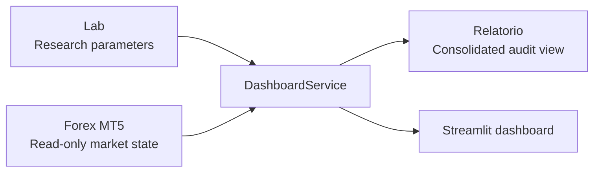

# Lab, Forex MT5, Report Flow

The Lab decides theoretical parameters such as setup, timeframe, entry, interest zone, and stop management. Forex MT5 reads lightweight market state only. Relatório consolidates Lab and Forex MT5 state for audit and monitoring.

This initial repository does not execute orders, read real positions, or connect to a broker operationally.
