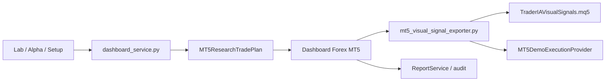

# TraderIA Novo - Analise dos Stops Moveis

Missao: `MISSION_TIA-004_ANALISAR_STOPS_MOVEIS`

Data: 2026-07-07

Escopo: auditoria documental da logica atual de saidas e stops moveis do
TraderIA Novo, sem alterar codigo operacional.

## Resumo Executivo

O TraderIA Novo ja possui uma esteira de pesquisa que avalia politicas de saida
no Lab e transporta a politica escolhida ate Forex, MT5 visual e relatorios.
O catalogo atual reconhece 9 politicas:

- `FIXED_STOP`
- `ATR_TRAILING_STOP`
- `BREAK_EVEN`
- `CHANDELIER_EXIT`
- `PARABOLIC_SAR`
- `DONCHIAN_CHANNEL_STOP`
- `MOVING_AVERAGE_EXIT`
- `TIME_STOP`
- `VOLATILITY_STOP`

Ha dois nomes citados historicamente que nao sao nomes canonicos no codigo
atual:

- `TRAILING_STOP`: equivalente operacional mais proximo e `ATR_TRAILING_STOP`.
- `TIME_EXIT`: equivalente canonico atual e `TIME_STOP`.

Ponto critico: a avaliacao do Lab contempla todas as politicas acima, mas a
execucao automatica de gestao de stop no MT5 demo hoje aplica modificacao real
de SL/TP apenas para `BREAK_EVEN` e `ATR_TRAILING_STOP`. As demais politicas sao
preservadas no contrato, aparecem no plano/sinal/relatorio, mas ainda nao tem
implementacao de ajuste dinamico no provider de execucao demo.

## Onde o Lab Define a Saida

### Catalogo oficial

Arquivo: `research/stop_management_catalog.py`

Este arquivo lista o catalogo inicial usado pelas camadas simples do Lab.

Arquivo: `research/mt5_research_trade_plan.py`

Elementos principais:

- `SUPPORTED_STOP_MANAGEMENT_POLICIES`
- `STOP_MANAGEMENT_PARAMETER_KEYS`
- `MT5ResearchTradePlanInput.stop_management`
- `MT5ResearchTradePlan.stop_management`
- `MT5ResearchTradePlanEngine.build_plan()`
- `MT5ResearchTradePlanEngine._normalize_stop_management()`
- `MT5ResearchTradePlanEngine._stop_management_parameters()`

Se uma politica desconhecida chegar ao motor, `_normalize_stop_management()`
volta para `FIXED_STOP`. Isso evita quebrar o plano, mas tambem mascara nomes
fora do contrato.

### Grade de pesquisa no dashboard service

Arquivo: `application/dashboard_service.py`

Funcoes principais:

- `_mt5_expand_stop_management_grid()`
- `_mt5_exit_management_variants()`
- `_mt5_scenario_for_parameters()`
- `_exit_management_score_adjustment()`
- `_mt5_scenario_historical_evidence()`
- `_exit_adjusted_scenario_return()`
- `_mt5_research_trade_plan_for_data()`

`_mt5_exit_management_variants()` expande cada configuracao base de Alpha/setup
em 9 variantes de saida. Cada variante recebe `stop_management` e seus
parametros especificos.

`_mt5_scenario_for_parameters()` pontua o candidato. A pontuacao combina:

- candidato de entrada/setup;
- ajuste leve da politica de saida;
- contexto temporal;
- evidencia historica leve por candle;
- certificacao de pesquisa.

Depois disso, `_mt5_research_trade_plan_for_data()` cria o plano final e
transporta `stop_management` e `stop_management_parameters` para o contrato do
plano de trade.

## Como Cada Politica Entra na Avaliacao

| Politica | Parametros principais | Intencao atual |
| --- | --- | --- |
| `FIXED_STOP` | nenhum | Stop e alvo fixos calculados pelo plano ATR/RR. |
| `ATR_TRAILING_STOP` | `atr_trailing_factor`, `atr_trailing_activation_rr` | Stop movel por ATR acompanhando preco favoravel. |
| `BREAK_EVEN` | `break_even_trigger_rr`, `break_even_offset_pips` | Move stop para entrada apos ganho minimo em R. |
| `CHANDELIER_EXIT` | `chandelier_period`, `chandelier_atr_factor` | Saida por maxima/minima e ATR em tendencia. |
| `PARABOLIC_SAR` | `sar_step`, `sar_max_step` | Stop baseado em SAR, mais sensivel a reversao. |
| `DONCHIAN_CHANNEL_STOP` | `donchian_stop_period` | Stop por canal/estrutura recente. |
| `MOVING_AVERAGE_EXIT` | `exit_ma_period`, `exit_ma_type` | Saida por media movel. |
| `TIME_STOP` | `max_bars_in_trade`, `max_minutes_in_trade` | Saida por tempo maximo de exposicao. |
| `VOLATILITY_STOP` | `volatility_window`, `volatility_multiplier` | Stop adaptado ao regime de volatilidade. |

## Por Que `BREAK_EVEN` Aparece Com Frequencia

O `BREAK_EVEN` pode ser favorecido por dois mecanismos atuais:

1. Ajuste de score:
   `_exit_management_score_adjustment()` da bonus maior para `BREAK_EVEN` quando
   a volatilidade esta baixa (`volatility <= 0.0003`).

2. Evidencia historica ajustada:
   `_exit_adjusted_scenario_return()` reduz perdas de `BREAK_EVEN` com fator
   `0.48`, mas tambem reduz ganhos com fator `0.70`.

Na pratica, em ambientes de baixa volatilidade ou sinais com retorno historico
instavel, o modelo pode preferir `BREAK_EVEN` porque ele parece proteger melhor
a perda media. Isso faz sentido como protecao, mas pode sacrificar operacoes que
precisariam de mais espaco para respirar. A proxima melhoria deve comparar
`BREAK_EVEN` contra saidas dinamicas com leitura de mercado, por ativo, setup e
timeframe.

## Fluxo Lab -> Forex -> MT5 -> Relatorio

### Lab

Arquivos relevantes:

- `application/lab_service.py`
- `research/lab_engine.py`
- `research/stop_management_catalog.py`
- `research/mt5_research_trade_plan.py`
- `application/dashboard_service.py`

O Lab calcula ou seleciona setup, entrada teorica, timeframe, parametros de
risco e politica de saida. No TraderIA Novo enxuto, `LabService` ainda possui
baseline `ATR_TRAILING_STOP`, enquanto o fluxo completo de pesquisa no
`DashboardService` expande as politicas e escolhe a melhor configuracao.

### Forex Runtime

Arquivos relevantes:

- `application/forex_mt5_service.py`
- `application/dashboard_service.py`
- `domain/contracts/forex_signal.py`
- `application/dashboard_view_model.py`

O Forex mostra estado atual, par, timeframe, decisao, preco, setup e politica
de saida. Ele deve consumir parametros do Lab, nao recalcular Lab pesado em cada
ciclo leve.

### MT5 Visual

Arquivos relevantes:

- `application/mt5_visual_signal_exporter.py`
- `mt5/indicators/TraderIAVisualSignals.mq5`

O exportador preserva:

- `stop_management`
- `stop_management_parameters`
- `stop_management_reason`
- `lab_alpha_id`
- `lab_timeframe`
- `lab_configuration`
- `entry`
- `stop`
- `target`
- `rr`
- `is_positioned`
- `position_open_time`

O indicador MQL5 le esses campos e exibe resumo de saida com
`ExitSummary(stop_management, rr)`.

### Execucao Demo MT5

Arquivo: `infrastructure/execution/mt5_demo_execution_provider.py`

Funcoes principais:

- `submit_order()`
- `has_open_position()`
- `apply_stop_management_from_signals()`
- `_managed_stop_update()`
- `_break_even_stop()`
- `_atr_trailing_stop()`

Situacao atual:

- `BREAK_EVEN`: implementado para mover SL para entrada/offset quando o preco
  anda pelo menos `break_even_trigger_rr` vezes o risco inicial.
- `ATR_TRAILING_STOP`: implementado para recalcular SL por ATR e fator.
- `FIXED_STOP`: nao envia gestao movel, por definicao.
- Demais politicas: ainda nao aplicam modificacao automatica de SL/TP no
  provider.

### Relatorio

Arquivos relevantes:

- `application/report_service.py`
- `application/mt5_trade_audit_service.py`
- `domain/contracts/report_row.py`
- `domain/contracts/trade_audit.py`

O relatorio consolida status e auditoria. Ele deve ser observador, nao fonte de
decisao. A trilha de saida aparece como detalhe de Lab e auditoria de posicao.

## Testes Existentes

Testes relevantes:

- `tests/test_lab_forex_mt5_contract.py`
- `tests/test_dashboard_view_model.py`
- `tests/test_mt5_research_trade_plan.py`
- `tests/test_mt5_visual_signal_exporter.py`
- `tests/test_mt5_demo_execution_provider.py`
- `tests/test_report_service.py`

Cobertura observada:

- preserva todas as politicas suportadas no contrato do plano;
- valida exportacao JSON de `BREAK_EVEN` e `ATR_TRAILING_STOP`;
- valida que a grade inclui todas as politicas;
- valida gestao demo para `BREAK_EVEN`, `ATR_TRAILING_STOP` e nao aplicacao em
  `FIXED_STOP`.

## Lacunas e Riscos

1. A pesquisa avalia 9 politicas, mas a execucao demo aplica apenas 2 politicas
   moveis.
2. `BREAK_EVEN` pode dominar cenarios de baixa volatilidade por bonus de score e
   reducao forte de perdas simuladas.
3. Nomes nao canonicos como `TRAILING_STOP` e `TIME_EXIT` devem ser normalizados
   em documentacao/missoes antes de chegar ao codigo.
4. O relatorio precisa continuar apenas auditando, sem decidir entrada ou saida.
5. Qualquer nova saida dinamica precisa ser implementada por missao pequena,
   com teste de contrato, teste de exportacao e teste do provider MT5 demo.

## Proxima Missao Recomendada

`MISSION_TIA-005_PROJETAR_SAIDA_DINAMICA_BASEADA_EM_LEITURA_DE_MERCADO`

Objetivo sugerido: desenhar, antes de codificar, como a saida dinamica deve ser
selecionada por ativo, setup e timeframe usando leitura de mercado real:

- regime de volatilidade;
- tendencia/momentum;
- distancia ate alvo/stop;
- tempo na posicao;
- posicao aberta no MT5;
- resultado parcial;
- politica escolhida originalmente pelo Lab.

Essa missao deve produzir desenho tecnico e criterios de aceite antes de
autorizar qualquer alteracao operacional.
